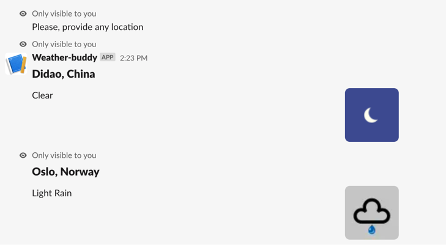

# Serverless - AWS Node.js Typescript

This project has been generated using the `aws-nodejs-typescript` template from the [Serverless framework](https://www.serverless.com/).


## Usage in Slack
### Installation
Command `/weather`

Request URL `https://wvtlk89nvc.execute-api.eu-west-1.amazonaws.com/dev/weather`

### Command

Command example: `/weather Oslo`


## Local usage instructions

Depending on your preferred package manager, follow the instructions below to deploy your project.

### Using NPM

- Run `npm i` to install the project dependencies

### Using Yarn

- Run `yarn` to install the project dependencies

### Project structure

The project code base is mainly located within the `src` folder. This folder is divided in:

- `functions` - containing code base and configuration for my lambda functions
- `interfaces` - containing shared interfaces
- `libs` - containing shared code base between my lambdas

```
.
├── src
│   ├── functions               # Lambda configuration and source code folder
│   │   ├── getWeatherByCityName
│   │   │   ├── handler.ts      # `getWeatherByCityName` lambda source code
│   │   │   ├── index.ts        # `getWeatherByCityName` lambda Serverless configuration
│   │   │   └── schema.ts       # `getWeatherByCityName` lambda input event JSON-Schema
│   │   │
│   │   └── index.ts            # Import/export of all lambda configurations
│   │
│   ├── interfaces              # TS Interfaces
│   │
│   └── libs                    # Lambda shared code
│       └── apiGateway.ts       # API Gateway specific helpers
│       └── getForecast.ts      # getForecast handler
│       └── handlerResolver.ts  # Sharable library for resolving lambda handlers
│       └── lambda.ts           # Lambda middleware
│
├── package.json
├── serverless.ts               # Serverless service file
├── tsconfig.json               # Typescript compiler configuration
├── tsconfig.paths.json         # Typescript paths
└── webpack.config.js           # Webpack configuration
```
